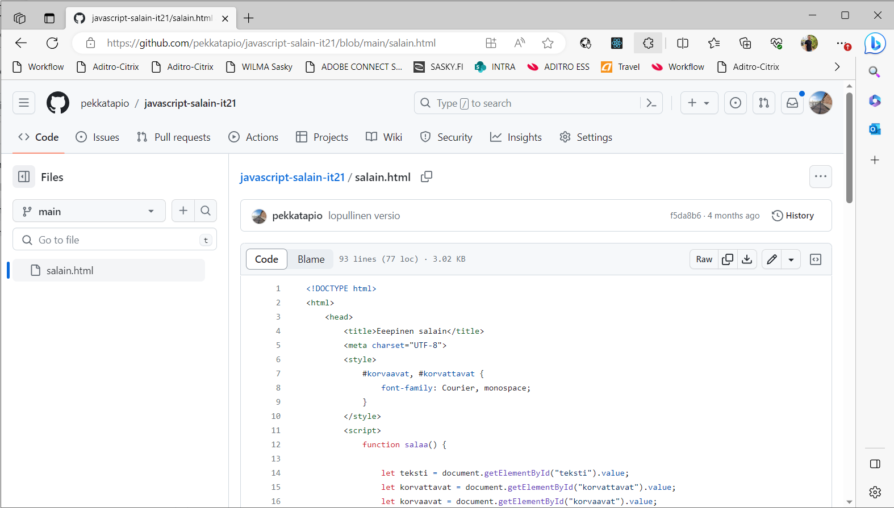

# Git & GitHub osana opetusta

## Git vs GitHub

**Git** on versiohallintajärjestelmä, joka julkaistiin alunperin 2005. Sitä kehittää mm. Linux-ytimestä tunnettu Linux Torvalds ja tänä päivänä se on käytetyin versiohallintajärjestelmä. Vaikka ohjelma on *komentorivipohjainen*, on sille toteutettu lukematon määrä erilaisia graafisia työkaluja, joilla sen käyttöä on helpotettu. Esimerkiksi Visual Studio Code -editorissa on sisäänrakennettu tuki Gitille.

Gitin perusajatuksena on, että lähdekoodista pidetään yhtä keskusvarastoa (central repository), josta kehittäjät tekevät itselleen kopion. Kehittäjät tekevät muutoksia omaan kopioonsa ja päivittävät lopulta omat muutoksensa keskusvarastoon muiden kehittäjien ladattavaksi. Tätä kutsutaan yleisesti *hajautetuksi versiohallinnaksi*.

Yksi Gitin vahvuuksista on se, että lähdekoodia työstettäessä koko versiohallinta on koko ajan paikallisella koneella. Tällöin lähdekoodin muokkaaminen ei ole kiinni verkkoyhteydestä. Verkkoyhteyttä tarvitaan lähinna silloin, kun lähdekoodiin tehdyt muutokset halutaan päivittää keskusvarastoon tai sinne tulleet muutokset ladataan omalle koneelle.

**GitHub** on (kaupallinen) pilvipalvelu, jonne voi tallentaa Git-versiohallinnalla hallinnoituja projekteja. Palvelu tarjoaa graafisen käyttöliittymän ja tallennustilaa projektirepoille. Palvelu on perustettu vuonna 2008 ja se on tänä päivänä Microsoftin omistuksessa. Vuosien mittaan GitHubin perustoiminta on pysynyt samanlaisena, mutta siihen lisätään koko ajan uusia ominaisuuksia. Esimerkiksi GitHub Actions mahdollistaa automatisoitujen julkaisujen toteuttamisen.

GitHub ei ole Gitin kilpailija, vaan se laajentaa Gitin käyttömahdollisuuksia. Git on avoimen lähdekoodin ohjelma, joten se on ilmainen. GitHub-pilvipalvelu on puolestaan kaupallinen, mutta se tarjoaa perustoiminnallisuuksia täysin ilmaiseksi, hienommista toiminnallisuuksista joutuu maksamaan.  

## Miten hyödynnetään opetuksessa?

Monet seuraavista tavoista edellyttävät, että opettajalla on Git asennettuna omalle koneelle. Kaikissa tapauksissa opiskelijalla ei tarvitse olla Gitiä asennettuna, mutta usein se jouhevoittaa käyttöä.

1. **Tunneilla tehtyjen ohjelmaprojektien jakaminen**

   GitHub mahdollistaa tunneilla tehtävien projektien helpon jakamisen linkittämällä GitHub-projektirepon esimerkiksi Moodleen. Opiskelija pystyy tarvittaessa hakemaan linkin kautta uusimman version projektista. Jos opiskelija on esimerkiksi ollut poissa tunneilta, niin hän pääsee helposti mukaan kopioimalla uusimman version projektista.

   

   Toiminta ensimmäisellä kerralla:
    - Alusta projektikansioon uusi repo komennolla `git init`.
    - Lisää kansion projektitiedostot seuraavaan talletukseen komennolla `git add .`.
    - Suorita talletus komennolla `git commit -m "7.9.2023 oppituntien tilanne"`.  
    - Luo GitHubiin uuden repon kuvaavalla nimellä ilman lisukkeita. 
    - Kytkee omalla koneella olevan repon GitHubiin reposivun **nn**-kohdan komennoilla.
    - Linkittää GitHubin reposivun esimerkiksi Moodleen.

    Toiminta seuraavilla kerroilla:
    - Lisää kansion muuttuneet projektitiedostot seuraavaan committiin komennolla `git add .`.
    - Suorita talletus komennolla `git commit -m "8.9.2023 oppituntien tilanne"`.
    - Vie uudet muutokset GitHubiin komennolla `git push origin`.