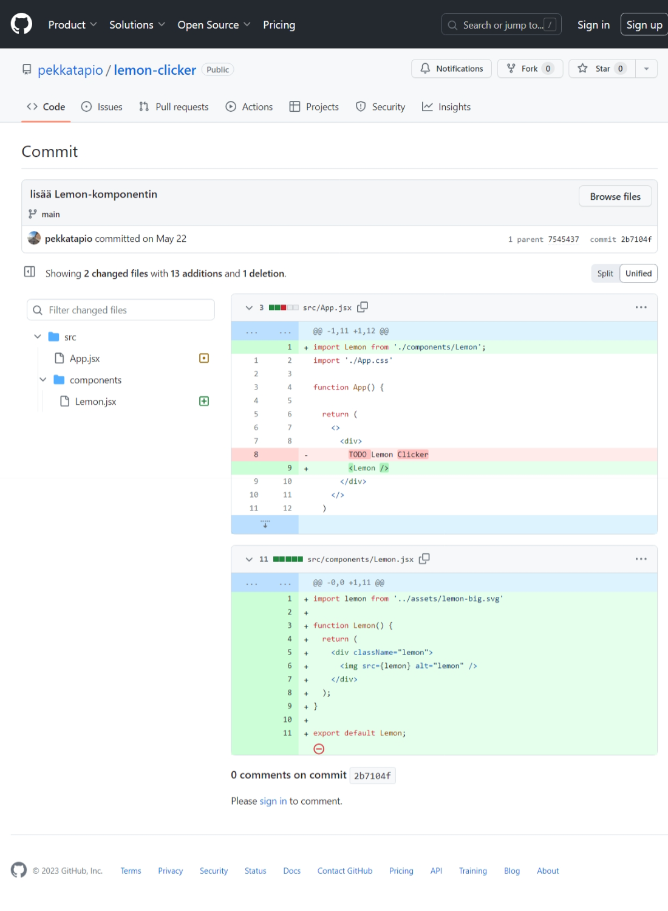
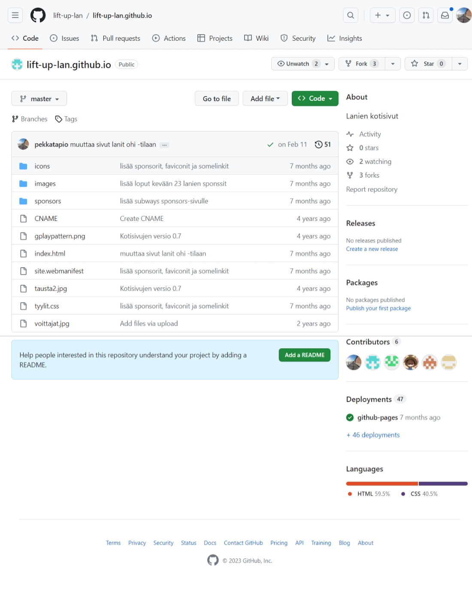
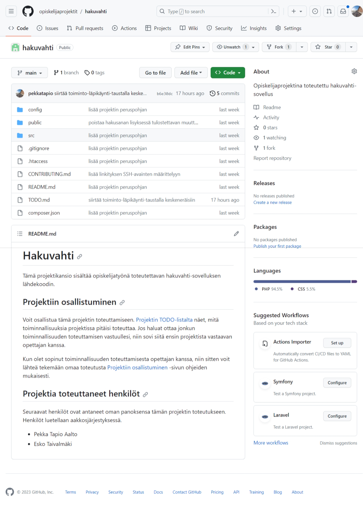

# Git & GitHub osana opetusta

## Git vs GitHub


**Git** on versiohallintajärjestelmä, joka julkaistiin alunperin 2005. Sitä kehittää mm. Linux-ytimestä tunnettu Linux Torvalds ja tänä päivänä se on käytetyin versiohallintajärjestelmä. Vaikka ohjelma on *komentorivipohjainen*, on sille toteutettu lukematon määrä erilaisia graafisia työkaluja, joilla sen käyttöä on helpotettu. Esimerkiksi Visual Studio Code -editorissa on sisäänrakennettu tuki Gitille.

Gitin perusajatuksena on, että lähdekoodista pidetään yhtä keskusvarastoa (central repository), josta kehittäjät tekevät itselleen kopion. Kehittäjät tekevät muutoksia omaan kopioonsa ja päivittävät lopulta omat muutoksensa keskusvarastoon muiden kehittäjien ladattavaksi. Tätä kutsutaan yleisesti *hajautetuksi versiohallinnaksi*.

Yksi Gitin vahvuuksista on se, että lähdekoodia työstettäessä koko versiohallinta on koko ajan paikallisella koneella. Tällöin lähdekoodin muokkaaminen ei ole kiinni verkkoyhteydestä. Verkkoyhteyttä tarvitaan lähinna silloin, kun lähdekoodiin tehdyt muutokset halutaan päivittää keskusvarastoon tai sinne tulleet muutokset ladataan omalle koneelle.


**GitHub** on (kaupallinen) pilvipalvelu, jonne voi tallentaa Git-versiohallinnalla hallinnoituja projekteja. Palvelu tarjoaa graafisen käyttöliittymän ja tallennustilaa projektirepoille. Palvelu on perustettu vuonna 2008 ja se on tänä päivänä Microsoftin omistuksessa. Vuosien mittaan GitHubin perustoiminta on pysynyt samanlaisena, mutta siihen lisätään koko ajan uusia ominaisuuksia. Esimerkiksi GitHub Actions mahdollistaa automatisoitujen julkaisujen toteuttamisen.

GitHub ei ole Gitin kilpailija, vaan se laajentaa Gitin käyttömahdollisuuksia. Git on avoimen lähdekoodin ohjelma, joten se on ilmainen. GitHub-pilvipalvelu on puolestaan kaupallinen, mutta se tarjoaa perustoiminnallisuuksia täysin ilmaiseksi, hienommista toiminnallisuuksista joutuu maksamaan.  

<div style="clear: both"></div>

## Git-versiohallinnan käyttöönotto

Git-versiohallintaa ei aina tarvitse olla asennettuna, mutta sen asennus helpottaa GitHubin käyttöä monissa tilanteissa. Alla on Gitin asennuksen suoraviivainen ohje.

1. Lataa Gitin asennusohjelma sen [virallisilta kotisivuilta](https://git-scm.com/).

2. Asenna Git käynnistämällä asennusohjelma. Voit valita asennusohjelmasta pääsääntöisesti *Next*-vaihtoehdon, ainoastaan *Choosing the default editor used by Git* -ruudussa kannattaa valita se tekstieditori, jota käytät aktiivisesti, kuten esimerkiksi Visual Studio Code.

3. Asennuksen jälkeen määritellään vielä omat tiedot komentorivillä seuraavasti:
   ```sh
   git config --global user.name "Olli Opettaja"
   git config --global user.email olli.opettaja@sasky.fi
   ```

4. Testaa gitin toiminta komentorivillä seuraavalla komennolla:
   ```sh
   git -v
   ```

   Jos git on asennettu oikein, niin komento tulostaa seuraavankaltaisen tekstin:
   ```
   git version 2.39.1.windows.1
   ```

## Miten hyödynnetään opetuksessa?

Monet seuraavista tavoista edellyttävät, että opettajalla on Git asennettuna omalle koneelle. Kaikissa tapauksissa opiskelijalla ei tarvitse olla Gitiä asennettuna, mutta usein se jouhevoittaa käyttöä.

1. **Tunneilla tehtyjen ohjelmaprojektien jakaminen**

   GitHub mahdollistaa tunneilla tehtävien projektien helpon jakamisen linkittämällä GitHub-projektirepon esimerkiksi Moodleen. Opiskelija pystyy tarvittaessa hakemaan linkin kautta uusimman version projektista. Jos opiskelija on esimerkiksi ollut poissa tunneilta, niin hän pääsee helposti mukaan kopioimalla uusimman version projektista.

   [](https://github.com/pekkatapio/javascript-salain-it21)

   Toiminta ensimmäisellä kerralla:
    - Alusta projektikansioon uusi repo komennolla `git init`.
    - Lisää kansion projektitiedostot seuraavaan talletukseen komennolla `git add .`.
    - Suorita talletus komennolla `git commit -m "7.9.2023 oppituntien tilanne"`.  
    - Luo GitHubiin uuden repon kuvaavalla nimellä ilman lisukkeita. 
    - Kytkee omalla koneella olevan repon GitHubiin reposivun **nn**-kohdan komennoilla.
    - Linkittää GitHubin reposivun esimerkiksi Moodleen.

    Toiminta seuraavilla kerroilla:
    - Lisää kansion muuttuneet projektitiedostot seuraavaan committiin komennolla `git add .`.
    - Suorita talletus komennolla `git commit -m "8.9.2023 oppituntien tilanne"`.
    - Vie uudet muutokset GitHubiin komennolla `git push origin`.

2. **Opetusmateriaalissa sisältöön tehdyt muutokset**

   GitHub näyttää selkeästi, mitä muutoksia projektiin on tehty edellisen talletuksen jälkeen. Tätä voi hyödyntää vaiheittain etenevässä opetusmateriaaleissa niin, että linkittää vaiheen lopuksi vastaavan kohdan GitHubin repossa.

   Esimerkiksi React-opetusmateriaalin [Funktiokomponentti](https://neutroni.hayo.fi/~pta/book/react101/clicker/01-aloitus/03-komponentti.html)-sivulla tehdyt muutokset näyttävät GitHubin talletusnäkymässä seuraavalta:

   [](https://github.com/pekkatapio/lemon-clicker/commit/2b7104f170cf2f9c5cf7b27011bb34f91c797aeb)

   Tämän koosteen avulla opiskelija hahmottaa helpommin, mihin kohtiin materiaalissa olevat muutokset kohdistuivat. 

3. **Kotisivujen julkaiseminen**

   Staattiset kotisivut on helppo julkaista [GitHub Pages](https://pages.github.com/) -toiminnallisuuden kautta. Kun sivuston sivut ovat ohjeistuksen mukaan nimetyssä repossa, niin sivut näkyvät automaattisesti kotisivuina `github.io`-domainin alla.

   Esimerkiksi Huittisten yksikön esports-opiskelijoiden järjestämien lanien kotisivut sijaitsevat GitHubissa. Lanien repo on julkinen ja se löytyy osoitteesta [https://github.com/lift-up-lan/lift-up-lan.github.io](https://github.com/lift-up-lan/lift-up-lan.github.io).

   [](https://github.com/lift-up-lan/lift-up-lan.github.io)

   Tätä repoa on ollut muokkaamassa myös muutama opiskelija vuosien varrella. Itse kotisivut löytyvät osoitteista [https://lift-up-lan.github.io](https://lift-up-lan.github.io) ja [https://liftup.hayo.fi](https://liftup.hayo.fi). GitHub Pages tukee myös omia domainosoitteita.

4. **Ohjelmointiprojektit**
 
   GitHubia voidaan myös käyttää juuri siihen, mihin se on tarkoitettu käytettäväksi eli useamman koodaajan ohjelmointiprojektien hallintaan. Opiskelijoiden kanssa voi noudattaa aika pitkälle samaa toimintamallia mitä käytetään open source -projektien kanssa.

   Esimerkkinä tästä on opiskelijoiden kanssa toteutettava [hakuvahti-projekti](https://github.com/opiskelijaprojektit/hakuvahti).

   [](https://github.com/opiskelijaprojektit/hakuvahti) 

   Projektin alussa:

    - Opiskelija luo forkin GitHubista löytyvästä projektista, johon aikoo osallistua.
    - Opiskelija kloonaa projektin omalle koneelleen komennolla:
      ```sh
      git clone (repon osoite)
      ```
    - Opiskelija aloittaa uuden kehityshaaran komennolla:
      ```sh
      git checkout -b kehityshaaran-nimi
      ```

   Projektin lopussa:

    - Opiskelija vie viimeisimmät muutokset repoon komennoilla:
      ```sh
      git add .
      git commit -m "lyhyt kuvaus muutoksista"
      git push origin kehityshaaran-nimi
      ```
    - Opiskelija menee GitHubissa projektin sivuille ja tekee seuraavat asiat:
       - Tässä vaiheessa on mahdollista, että jokin toinen on tehnyt muutoksia samoihin tiedostoihin, jolloin omat muutokset ovat ristiriidassa niiden kanssa. Nämä muutokset pitää yhdistää ennen kuin pystyy jatkamaan.
       - Painaa vihreää **Compare & pull request** -nappia.
       - Kirjoittaa kuvaavan tekstin otsikoksi ja lyhyen kuvauksen kuvaustekstiksi.
       - Painaa vihreää **Create pull request**-nappia.
       - Odottaa opettajan palautetta.

